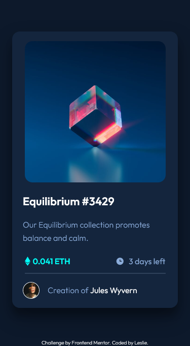
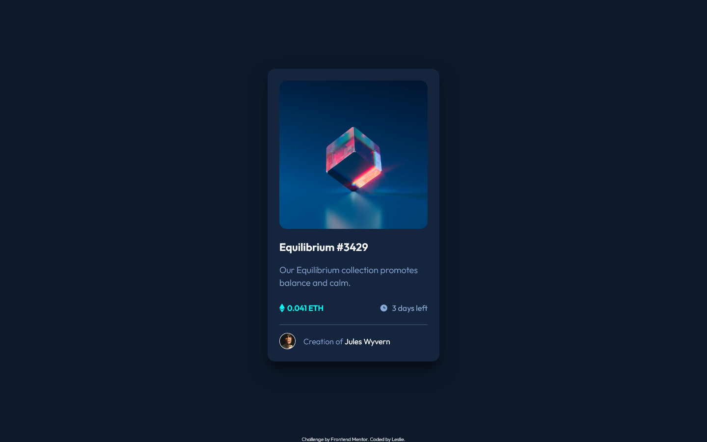

# Frontend Mentor - NFT preview card component solution

This is a solution to the [NFT preview card component challenge on Frontend Mentor](https://www.frontendmentor.io/challenges/nft-preview-card-component-SbdUL_w0U). Frontend Mentor challenges help you improve your coding skills by building realistic projects. 

## Table of contents

- [Overview](#overview)
  - [The challenge](#the-challenge)
  - [Screenshot](#screenshot)
  - [Links](#links)
- [My process](#my-process)
  - [Built with](#built-with)
  - [What I learned](#what-i-learned)
  - [Continued development](#continued-development)
  - [Useful resources](#useful-resources)
- [Author](#author)

## Overview

### The challenge

Users should be able to:

- View the optimal layout depending on their device's screen size
- See hover states for interactive elements

### Screenshot

### Links

- Live Site URL: [NFT preview card component](https://leslief10.github.io/nft-preview-card-component/)

## My process

### Built with

- Semantic HTML5 markup
- CSS custom properties
- Flexbox
- CSS Grid
- Mobile-first workflow

### What I learned

Image Hover Overlay is harder than it looks like. I'll experiment a bit with transitions/transformations to learn a bit more.

### Continued development

At some point in the future I'll come back to this challenge to correct the color of the svg I used for the overlay. I tried with the filter property, but I only got it to look black. 

### Useful resources

- [How TO - Image Hover Overlay](https://www.w3schools.com/howto/howto_css_image_overlay.asp) - This helped me with the image overlay.

## Author

- Website - [Leslie Fernandez](https://github.com/leslief10)
